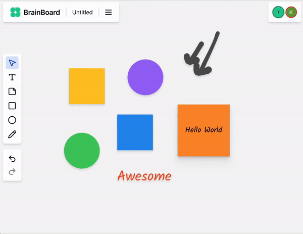

# **Brain Board**

Brain Board is a real-time collaboration and idea visualization platform. It allows users to sketch, organize, and brainstorm on a flexible, interactive digital canvas. The platform is designed to unlock creativity, share ideas, and facilitate seamless collaboration among team members, regardless of their location.

## **Features**

- Real-time collaboration on a digital canvas
- Interactive and flexible canvas for sketching and organizing ideas
- Support for multiple users and teams
- Seamless integration with Clerk for authentication and Convex for data storage

## **Technology Stack**

- Frontend: Next.js, React, TypeScript
- Backend: Convex, Clerk
- Database: Convex
- Authentication: Clerk

## **Components and Modules**

- `src/app/(dashboard)/client.tsx`: The main client-side component for the dashboard
- `src/app/board/[id]/page.tsx`: The page component for individual boards
- `src/components/auth/loading.tsx`: The loading component for authentication
- `src/components/ui/skeleton.tsx`: The skeleton component for UI elements
- `convex/_generated/api.d.ts`: The generated API utility for Convex

## **API Documentation**

The Convex API is used for data storage and retrieval. You can find the API documentation in the `convex/_generated/api.d.ts` file.

## **Getting Started**

To get started with Brain Board, follow these steps:

1. Clone the repository: `git clone https://github.com/your-username/brain-board.git`
2. Install dependencies: `npm install` or `yarn install`
3. Start the development server: `npm run dev` or `yarn dev`
4. Open your browser and navigate to `http://localhost:3000`

## **Contributing**

Contributions are welcome! If you'd like to contribute to Brain Board, please fork the repository and submit a pull request.

## **License**

Brain Board is licensed under the MIT License.

## **Acknowledgments**

- Clerk for authentication and Convex for data storage
- Next.js and React for the frontend framework
- TypeScript for type safety
